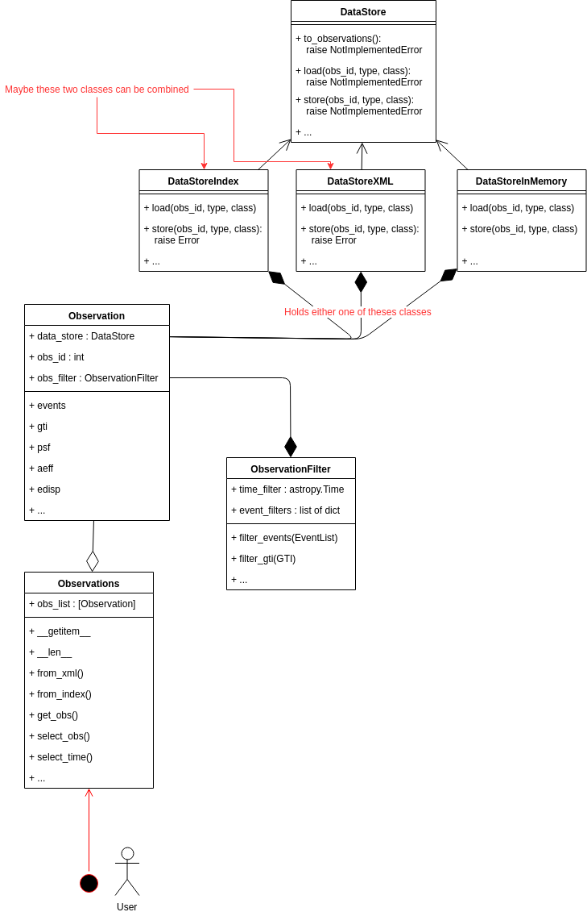

.. include:: ../../references.txt

.. _pig-006:

********************************
PIG 6 - CTA observation handling
********************************

* Author: David Fidalgo, Christoph Deil, Régis Terrier et al
* Created: Oct 10, 2018
* Withdrawn: Oct 31, 2019
* Status: withdrawn
* Discussion: `GH 1877`_

Abstract
========

In this PIG we want to outline an improvement of the CTA observation handling in
Gammapy. The current handling has some limitations and misses some key features,
like selecting a given time interval and performing an analysis on it. We also
want to start using GTI to compute the observation time, instead of relying on
header information. Since specifics of the final data format of CTA are still
unclear, this PIG does not aim for a final implementation of CTA observation
handling, nor the handling of all types of data from various instruments
foreseen for Gammapy in the future. Instead it focuses on trying to resolve
current limitations when analyzing IACT data, namely an analysis of time or
phase selected observations, as well as an analysis of an observation stored
solely in memory or given in ctool's XML format. This PIG emerged at the Coding
Spring in Madrid 2018.

Some terminology
================

This terminology and the definition of the terms will probably change or be
expanded once the final data format of CTA is decided. For now we will use
following definitions to go forward in Gammapy:

- **GTI (good time interval)**:
   - time intervals for which the instrument was on
   - the sum over these time intervals equals the *on time*
   - a GTI table will be required for each observation

- **Observation**:
   - has a unique identifier, the *obs_id*
   - contains 1 event list, 1 GTI table and 1 corresponding set of IRFs (aeff, edisp, psf)
   - a GTI table is more convenient than a ``START`` and ``STOP`` time, it is more flexible and allows to cut out time intervals in between
   - has 1 dead-time fraction (``DEADC``), the live time of the observation is obtained as ``ONTIME * (1 - DEADC)``
   - however, in the future ``DEADC`` is probably going to be `absorbed into the IRFS`_, then we should switch from *live time* to *on time* when calculating the exposure
 

* **Observation library**:
   - the repository where the observations and IRFs are stored
   - it has a manifest connecting all observation files and their IRFs

Status
======

In the current implementation we use the ``DataStore`` class to connect to an
*observation library* that consists of two fits files, the *observation index
table* and the *HDU index table* (see `gadf`_). The ``DataStoreObservation`` is
a proxy object to the ``DataStore`` and points to a single *observation* in the
*observation library*. The ``DataStoreObservation`` never holds on to the
observation data in memory and only reads it when explicitly accessed
(``.events``, ``.gti``, ``.aeff``, etc.). However, it does some caching of meta
data. Recently a new observation class ``ObservationCTA`` was added that is
capable of storing all observation data in memory. However, with the new scheme
proposed further down, this class becomes superfluous and can again be removed.

Normally the user starts an analysis with the creation of a ``DataStore`` object
from which she/he extracts an ``ObservationList`` providing *obs_ids*. All
analysis classes take as input an ``ObservationList``, which is basically a
python list of ``DataStoreObservation``.

Limitations
-----------

* We can only analyze data for which its *observation library* has the index table format.
* The current scheme does not allow for an analysis of a given time interval by the user.
  Only full runs/observations can be processed.
* We do not support event selections before starting the analysis steps, such as event type selection, phase selection or time selection.
* It is cumbersome to write a copy of an observation (possibly modified) back to disk

Objectives
==========

* Users should be able to run an analysis (1D and 3D) on a given time interval, independent of the time intervals of the single observations.
* We should support event selections before starting the analysis steps (event phase, event type, ...) and possibly allow for custom selections, e.g. `MC_ID` in the current CTA 1DC.
  For now we aim only for a time and phase filtering of events, a filtering on event type, for example, is more complex and is left for a future PIG.
* We want to support more formats for the *observation library* (like ctools XML format)
* We want to support observations (especially event lists) stored in memory

Use cases / scenarios
---------------------

1. Scenario: 1D/3D analysis for a user specified time interval
    | **Given** a user specified time interval
    | **When** performing a 1D/3D analysis of the corresponding observations
    | **Then** get results only for the specified time interval

2. Scenario: 1D/3D analysis for a user specified pulsar phase interval
    | **Given** a user specified pulsar phase interval
    | **When** performing a 1D/3D analysis of the corresponding observations
    | **Then** get results only for the specified phase interval

- Make GPS survey maps for CTA (process 10 GB of events data and 3000 runs, testing the memory usage)
- Create an observation *from scratch* and write it to disk with Index files
- Read in an observation from an *observation library* given in ctool's XML format

What others have
================

With *Fermi-LAT*, you always have ``gtselect`` and ``gtmktime`` at the start
(see `Fermi-LAT data preparation`_). Following analysis steps partly rely on
"data sub space" DSS header keys for processing, which are stored in the output
fits files of the `gtselect` and `gtmktime` step.

In *ctools*, every analysis starts with an "observation definition file" in XML
format. One can then select observations with ``csobsselect``, creating a new
observation definition file. A selection based on events is achieved by running
``ctselect``.

Proposal
========

General idea and class diagram
------------------------------

The general idea is to have an ``Observations`` class that is the starting point
of all analyses and is passed on to the analysis classes of the 1D and 3D
analysis (effectively it replaces the ``ObservationList`` class). The user should
only have to interact with this class, which makes it an **interface** to the
other classes described in the following (``Observation`` and ``DataStore``), and
therefore mainly consists of *convenient functions*. The ``Observations`` class
holds a list of ``Observation`` objects.

The ``Observation`` class is essentially a **proxy class** to the *data store*
classes. In addition an ``Observation`` object will also hold an
``ObservationFilter`` object, which is used to **orchestrate the filtering** of
the data, mainly the event list. The filtering is applied *on-the-fly* when
accessing the observation data. In this way we avoid storing the modified
observation data in memory, which is important for the last use case specified
above.

The different **data store** classes are (this still needs to be discussed in
more detail):

- ``DataStoreIndex``: This is basically just a renaming of the current ``DataStore``
- ``DataStoreXML``: This class is able to read XML files as used for *ctools* (maybe this class can be combined with the ``DataStoreIndex``)
- ``DataStoreInMemory``: This *data store* class is special in the sense that it does not point to files on disk, but holds the information data in memory.
  This can be useful when creating observations from *scratch*, by simulating the event list for example.

All *data store* classes inherit from a **parent** ``DataStore`` class that names the necessary methods, which have to be implemented by the Child classes.

The new scheme proposed is illustrated by the class diagram below. The
attributes and methods of the classes are not fully worked out and are merely
suggestive.

Implementation road map
-----------------------

We will outline the road map in form of scenarios that we want to achieve along
the way and that can be implemented ideally with a few PRs.

We split the implementation in two big steps:

* first we want to focus on implementing the ``Observations``, ``Observation`` and ``ObservationFilter`` classes
* the second step is the work on the ``DataStore`` classes

**Scenarios**:

1. Scenario: Run a 1D/3D analysis wth the ``Observations`` class
    | **Given** a basic version of the ``Observations`` class
    | **When** passed on to the analysis classes
    | **Then** should behave the same as the current ``ObservationList`` class

    | **PRs**: ObservationList -> Observations, initialize with a list of ``DataStoreObservation``; implement ``__len__``, ``__getitem__``; adapt notebooks

2. Scenario: Add an empty filter to an `Observation`
    | **Given** a basic version of the `Observation` and `ObservationFilter` class
    | **When** accessing `.events`, `.gti` of the `Observation`
    | **Then** automatically apply the empty filter on the fly

    | **PRs**: `DataStoreObservation` -> `Observation`; create `ObservationFilter` class; add an `ObservationFilter` to each `Observation`; develop basic API

3. Scenario: filter an ``Observation`` by time
    | **Given** a user specified time interval
    | **When** we give the time interval to an `Observation`
    | **Then** return a new ``Observation`` with the according time filter

    | **PRs**: Introduce time filters for events and gtis; Add ``select_time`` method to the Observation class

4. Scenario: filter an ``Observation`` by pulsar phase
    | **Given** a user specified phase interval
    | **When** we give the phase interval to an ``Observation``
    | **Then** return a new ``Observation`` with the according phase filter

    | **PRs**: Add ``select_phase`` method to the Observation class
    
5. Scenario: filter ``Observations`` by time
    | **Given** a user specified time interval
    | **When** we give the time interval to the ``Observations``
    | **Then** return a new ``Observations`` holding the selected ``Observation`` objects with the respective time filter

    | **PRs**: Add ``select_time`` method to the ``Observations`` class;

Proposed class diagram
----------------------

Decision
--------

This PIG was written in fall 2018. It was intended as a design document and work
plan, but didn't reach a state where it was complete and ready for review. Then
the original author left astronomy, and the other developers continued
throughout 2019 without using the PIG. We now feel that withdrawing the PIG is
the best course of action, making room for new pull requests and PIGs in the
future to improve CTA observation handling in Gammapy. It's not a "solved
problem", instead it will be an intense focus of work in Gammmapy and CTA in the
coming years.

.. _GH 1877: https://github.com/gammapy/gammapy/pull/1877
.. _absorbed into the IRFs: https://github.com/open-gamma-ray-astro/gamma-astro-data-formats/issues/62#issuecomment-428221596
.. _Fermi-LAT data preparation: https://fermi.gsfc.nasa.gov/ssc/data/analysis/scitools/data_preparation.html
