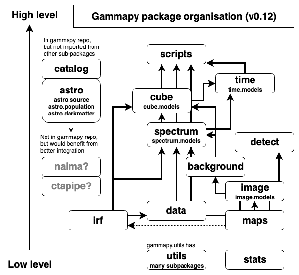

.. include:: ../../references.txt

.. _pig-016:

**********************************
PIG 16 - Gammapy package structure
**********************************

* Author: Christoph Deil, Axel Donath, Régis Terrier
* Created: July 5, 2019
* Status: draft
* Discussion: `GH 2274`_

Abstract
========

Gammapy is currently (as of v0.12 in July 2019) structured into 14 sub-packages,
with 6 further structured into sub-sub-packages: utils, spectrum, image, cube,
astro, time. 

This PIG describes some options to change the package structure (add or remove
sub-packages), and points out some advantages and disadvantages of possible
changes.

Currently the recommended changes are very small, to be implemented in v0.14
(September 2019) which would then already be the structure for v1.0 (October
2019). However, there are some larger changes we should discuss and consider,
currently listed in the alternatives section.

Introduction
============

The current Gammapy package structure (as of v0.12, probably the same in v0.13):



This illustrates the namespaces where the Gammapy API is exposed. the number of
Python files is much larger (about 100) and not so important.

``gammapy.astro`` and ``gammapy.catalog`` are independent from the rest of
Gammapy in the sense that they are not imported or used from elsewhere. Still,
they are useful, and they do import many things from Gammapy, e.g. the spectral
and spatial model classes. We will clean them up a bit, but they will remain
mostly as-is in Gammapy. Splitting them out isn't a good idea at this point, not
clear where they would go, and maintaining multiple repos is much harder than
one repo and their code would break immediately, since the Gammapy API isn't stable
yet.

Also ``gammapy.detect`` and ``gammapy.time`` are mostly high-level and not used
from anywhere else (except possibly from ``gammapy.scripts`` soon. Therefore we
will not say much about them in this PIG.

The main question here is how to structure the code for data, IRFs, maps and spectra
into sub-packages.

Proposal
========

Remove gammapy.background
-------------------------

We propose to remove ``gammapy.background``, and to move ``reflected.py`` to ``gammapy.spectrum``,
and the other few things to ``gammapy.image`` or ``gammapy.cube``.

This would mean that the dependency chain ``maps`` -> ``image`` ->
``background`` -> ``spectrum`` -> ``cube`` is resolved, making ``spectrum`` less
tightly coupled to the rest, mostly independent of ``image`` and ``cube``.

Clean up gammapy.utils
----------------------

tbd

Other options
-------------

There's a few other smallish changes we could do, if we think they are improvements:

Introduce a ``gammapy.models`` package and group ``gammapy.spectrum.models``,
``gammapy.image.models``, ``gammapy.cube.models`` and ``gammapy.time.models``
there together. The ``gammapy.utils.fitting`` could be moved there or could stay
as-is, e.g. in Astropy they have ``astropy.modeling`` with the framework and
``astropy.modeling.models`` with the many models.

Dissolve ``gammapy.image``, moving it's content to ``gammapy.cube``. The main
thing it contains is ``gammapy.image.models``, the rest is just a few
conveniences that could also be removed (e.g. to make profiles from images).
If we introduce ``gammapy.models`` then ``gammapy.image.models`` would go there.

We could rename ``cube`` to ``mapanalysis`` to make it clearer what it does?
Moving all of ``gammapy.image``, ``gammapy.background`` and ``gammapy.cube``
into ``gammapy.maps`` should be possible (all map-based data structures and
algorithms in one place). But this might introduce circular dependencies with
``spectrum```, which are currently avoided by having ``maps`` -> ``spectrum`` ->
``cube``, where ``cube`` can use things from ``spectrum``.

Similar to models, built-in dataset subclasses could be grouped in a new
``gammapy.datasets``. Although this might introduce circular dependencies within
Gammapy, it's less clear than for ``models`` if this is a good idea.

Outlook
=======

Generalising maps to allow maps without a WCS and spatial axes, and / or using
it everywhere in Gammapy (for IRFs, spectra, lightcurves) could be nice.
Possibly ALMA does this, all their data is in 4D containers with lon, lat,
wavelength, time, and e.g. a 1D spectrum would have only one bin in lon, lat,
time. This is something we should explore for Gammapy 2.0 in 2020, doesn't seem
feasible for Gammapy 1.0 in 2019.

Currently the fact that ``naima`` is a separate package is causing problems. We
can't add anything there, and we have to wrap the spectral models there, which
is inconvenient for us as developers, but mostly the issue is that users have to
learn two different modeling APIs to use Naima and Gammapy. We could pull
``naima`` into ``gammapy.astro.naima`` (or rename to ``gammapy.astro.radiation``
or something), or a separate good Python nonthermal modeling package might
appear and we interface or integrate that with Gammapy. For v1.0 we probaly
don't have enough time or manpower to pull it in. For now, we leave
``gammapy.astro`` and ``gammapy.catalog`` in Gammapy, but some people have
suggested to split it out from Gammapy, and in that sense pulling ``naima`` in
would be the wrong direction.

The relationship between ``gammapy`` and ``ctapipe`` is unclear. Not so much
functionality wise, but in terms of Python package dependency, i.e. who imports
from whom. We would benefit a lot from shared development, e.g. ``ctapipe`` has
a Tool / Component concept and provenance already, and Gammapy already has IRF
classes and sensitivity computation tools that are needed by the pipeline. We
just note this question here, for Gammapy v1.0 we don't propose to introduce any
coupling on our side, i.e. if we want to use something from ``ctapipe`` such as
the ``Tool`` class, we would put a copy in ``gammapy.extern`` to avoid the
dependency.

Task list
=========

tbd

Alternatives
============

- 

Decision
========

tbd


.. _GH 2274: https://github.com/gammapy/gammapy/pull/2274
