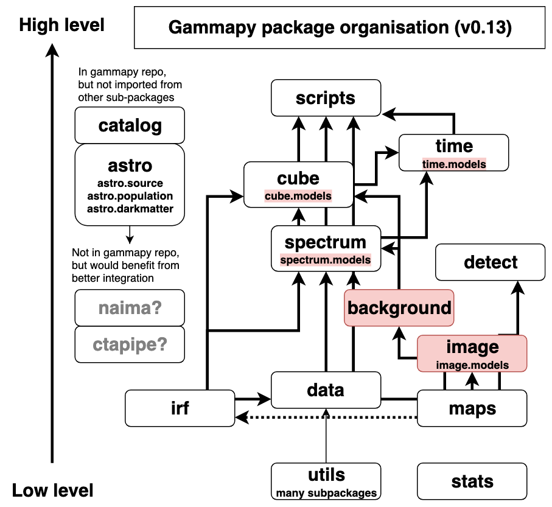
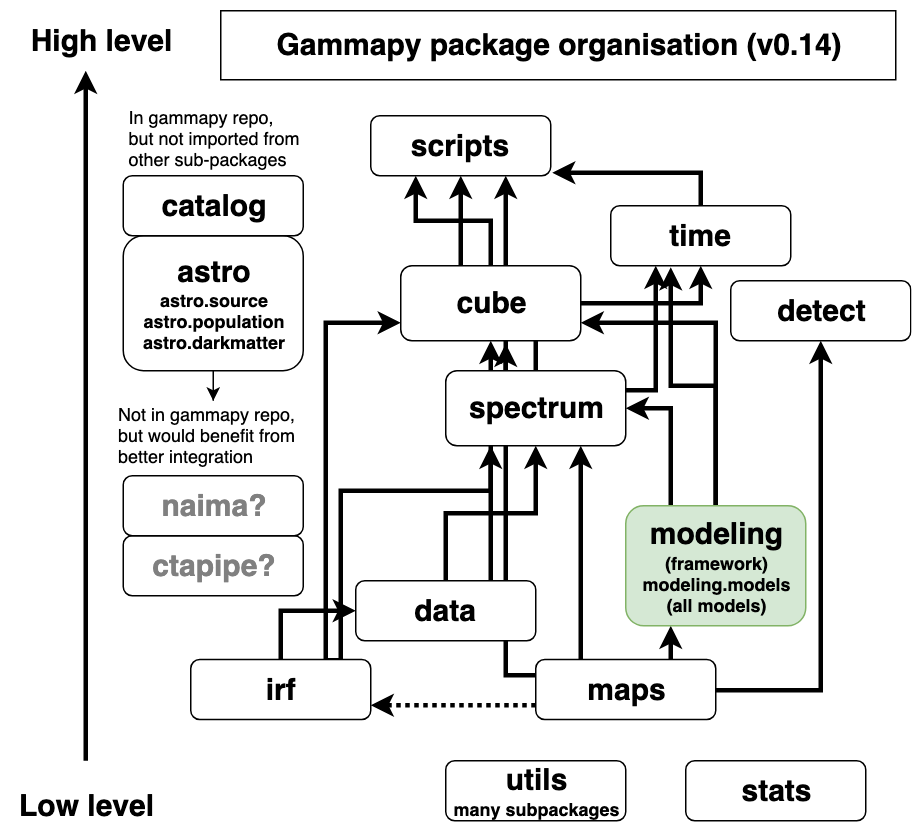

.. include:: ../../references.txt

.. _pig-016:

**********************************
PIG 16 - Gammapy package structure
**********************************

* Author: Christoph Deil, Axel Donath, Régis Terrier
* Created: Jul 5, 2019
* Accepted: Aug 18, 2019
* Status: accepted
* Discussion: `GH 2274`_

Abstract
========

Gammapy is currently (as of v0.13 in July 2019) structured into 14 sub-packages.
Six of those are further structured into sub-sub-packages: utils, spectrum,
image, cube, astro, time. Here we show the structure of the Gammapy package and
consider possible changes to improve it.

For Gammapy v0.14 in September 2019 (and same for v1.0), we propose the
following changes:

* move gammapy.utils.fitting to gammapy.modeling, and to move all models from
  spectrum, image, cube and time to gammapy.modeling.models
* dissolve gammapy.background, moving its code into gammapy.spectrum
  and gammapy.cube
* dissolve gammapy.image, moving the useful functionality to gammapy.maps and
  gammapy.cube.
* Clean up gammapy.utils sub-packages

After Gammapy v1.0, we propose to continue discussion on other changes
considered while writing this PIG, described in the outlook section.

Status
======

The current Gammapy package structure (as of v0.13):

This illustrates the namespaces where the Gammapy API is exposed. The number of
Python files is much larger (about 100) and not important for the end-user API.

Proposal
========

We propose to introduce gammapy.modeling and gammapy.modeling.models, to
dissolve gammapy.background and gammapy.image in the v0.14 development cycle,
resulting in the following package structure for Gammapy v0.14 and v1.0:

The following sections explain and motivate the proposed changes.

Introduce gammapy.modeling
--------------------------

Currently our fitting and modeling framework is in gammapy.utils.fitting,
and the built-in models in Gammapy are distributed like this:

* gammapy.modeling.models -- 1D spectral models
* gammapy.image.models -- 2D spatial models
* gammapy.cube.models -- 3D cube models
* gammapy.time.models -- 1D time models

Our proposal is to create a new sub-package gammapy.modeling and
gammapy.modeling.models following the organisation chosen for models in Astropy and
restructure code like this:

* gammapy/utils/fitting -> gammapy/modeling/fitting
* gammapy/utils/serialisation -> gammapy/modeling/serialisation
* gammapy/spectrum/models -- gammapy/modeling/models/spectrum
* gammapy/image/models -- gammapy/modeling/models/image
* gammapy/cube/models -- gammapy/modeling/models/cube
* gammapy/time/models -- gammapy/modeling/models/time

Since it is very inconvenient for users to have to type sub-sub-sub-package
names, we propose to expose the end-user API direction in gammapy.modeling for
general classes (Parameter, Parameters, Model, Fit, Dataset). For the models, we
propose to expose them in gammapy.modeling.models (same as Astropy), and to
introduce a factory function to make it easy to make models that is easy to
import and use. E.g. it could be gammapy.modeling.make_model and take a model
specification string or dictionary. Developing the syntax and schema for this
"model specification language" isn't in scope for this PIG. It will be done as
part of the effort on model serialisation in Gammapy in the coming months.

We propose to add "Source" to all (currently 3D) source models, and to add
"Spectral", "Spatial" and "Time" for the spectral, spatial and time models. This
avoids user confusion concerning the type of model, which currently exists in
v0.13, because for some models (Gaussian, diffuse, table, constant) it isn't
obvious what kind they are. The drawback is that this generates very long class
names, such as e.g. SpectralExponentialCutoffPowerLaw3FGL.

The motivation for this change is weak, but in discussions at the Erlangen
coding sprint most Gammapy developers preferred it. The reasoning was that it's
a bit easier to find and maintain models if they are all in one place.

There was a concern that this might introduce circular dependencies between
gammapy.modeling.models and e.g. gammapy.spectrum, gammapy.image, gammapy.cube
or gammapy.time. But in `GH 2290`_ it was shown that this is not the case, the
proposed change works well.

There is still the open question whether models will keep this simple interface,
or if we will add an evaluation caching layer, or whether eventually reduced
IRFs will become models. So it is very much possible that there will be other
changes concerning the Gammapy package structure in the future.

Dissolve gammapy.background
---------------------------

We propose to dissolve gammapy.background, and move the code like this:

* background_estimate.py, reflected.py, phase.py -> gammapy/spectrum
* ring.py -> gammapy/cube/background_ring.py

The motivation for this change is that currently map-related background
estimation code is split into gammapy/background and gammapy/cube without a
clear separation what goes where. So the choice was either to move everything to
dissolve gammapy.background or to move all background-related code to
gammapy.background.

Looking at the package structure illustration above, it's clear that
gammapy.background is problematic, because it is lower level than
gammapy.spectrum and gammapy.maps, so moving background estimation classes from
gammapy.cube down to gammapy.background would likely lead to circular
dependencies, because they rely on the map dataset class in gammapy.cube.

The reflected region background code is not a great fit in gammapy/spectrum or
anywhere in Gammapy except for gammapy.background, but moving it there does make
sense if we say that all 1D spectrum code goes in gammapy.spectrum and all
map-related analysis code goes in gammapy.cube. Scalar background statistics,
i.e. for a given region and energy band, can be created via methods on the 1D
and 3D dataset classes.

Dissolve gammapy.image
----------------------

The gammapy.image package was introduced early and contained a SkyImage class
for 2D sky images, and 2D image models, and some image analysis helper functions
such as code to make a radial profile from an image. Much later gammapy.maps was
introduced and we managed to support 2D and 3D maps with one container instead
of separate gammapy.image.SkyImage and gammapy.cube.SkyCube.

Now, if we move gammapy.image.models to gammapy.modeling as proposed above, and
that SkyImage has been removed in 2018, there is very little functionality left
in gammapy.image, and it's not clear what its scope is.

So we propose to clean this up, roughly like this:

* utils.py -> one helper function, move to gammapy/maps/utils.py
* asmooth.py -> move to gammapy.detect
* measure.py and profile.py -> move to gammapy.maps (and clean up)
* plotting.py -> move to gammapy/maps/plotting.py (remove illustrate_colormap
  and grayify_colormap)

Clean up gammapy.utils
----------------------

Above we propose to move gammapy.utils.fitting, the biggest piece of
gammapy.utils to gammapy.modeling. We still need and want to keep gammapy.utils,
as a lowest level layer in Gammapy where we write adapters and helpers for
functionality e.g. from Numpy and Astropy. Mostly this is for usage within
Gammapy, users very rarely need to import from gammapy.utils. Currently only
energy_logspace, sqrt_space, sample_powerlaw and SphericalCircleSkyRegion are
used from end-user documentation, i.e. very little.

We propose to clean up gammapy.utils, e.g. gammapy/utils/coordinates.py still
contains coordinate helper functions that were added before astropy.coordinates
existed. We do not detail the cleanup here, this will be discussed on a
case-by-case basis. After that we will review what is left and decide which
parts do mention in the public API docs and which to keep as purely internal code.

Outlook
=======

During discussion of this PIG, several other ideas surfaced and were considered.
The following ideas could be considered and evaluated for feasibility (as done
in `GH 2290`_ for gammapy.modeling) in the future.

* Generalising maps to allow maps without a WCS and spatial axes, and / or using
  it everywhere in Gammapy (for IRFs, spectra, lightcurves) could be nice.
  Possibly ALMA does this, all their data is in 4D containers with lon, lat,
  wavelength, time, and e.g. a 1D spectrum would have only one bin in lon, lat,
  time. It's not clear if and what changes this would imply for the Gammapy
  package structure.
* CTA IRFs and other CTA data level 3 classes might be maintained in ctapipe or
  somehow shared between Gammapy and ctapipe.
* gammapy.spectrum will likely become higher level than gammapy.cube, i.e. 1D
  spectral analysis will be based on 3D maps analysis more.
* gammapy.detect will likely grow map analysis and modeling based algorithms,
  i.e. depend on gammapy.cube and the rest of the Gammapy package
* gammapy.astro could grow (merge in Naima) or be split out from Gammapy.
* gammapy.cube could be renamed to gammapy.map_analysis. gammapy.scripts could
  be renamed to gammapy.analysis. Or similar changes to better names could be
  made, depending on how the purpose and scope change of sub-packages changes.
* Datasets could be grouped in gammapy.datasets, if they are simple container
  objects (like models) that aren't tightly coupled with analysis code in
  gammapy.spectrum and gammapy.maps.

Decision
========

The PIG was extensively discussed at the Gammapy coding sprint in July 2019 and
in `GH 2274`_. A final review announced on the Gammapy and CC mailing list did
not yield any additional comments. Therefore the PIG was accepted on August 18,
2019.

.. _GH 2219: https://github.com/gammapy/gammapy/pull/2219
.. _GH 2274: https://github.com/gammapy/gammapy/pull/2274
.. _GH 2290: https://github.com/gammapy/gammapy/pull/2290
.. _gammapy-benchmarks: https://github.com/gammapy/gammapy-benchmarks
