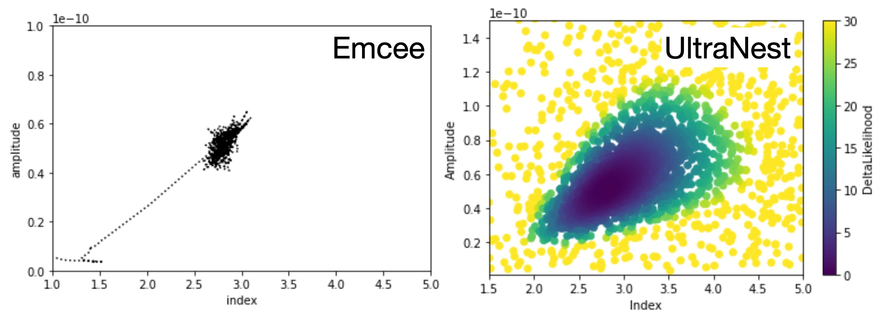

.. include:: ../../references.txt

.. _pig-027:

****************************************************
PIG 27 - Bayesian Inference using Nested Sampling
****************************************************

* Author: Fabio Acero, Régis Terrier, Bruno Khelifi
* Created: ``2024-10-14``
* Accepted: ``2025-01-29``
* Status: Accepted
* Discussion:

Abstract
========

This PIG is intended to introduce a Bayesian Inference class to support nested sampling algorithm to estimate
the marginal evidence and the posterior distributions of all model parameters.

Motivation
==========

(The material below are some notes that I took that can be used later for a tutorial introduction)

Bayesian inference uses prior knowledge, in the form of a prior distribution, in order to estimate posterior probabilities which we traditionally visualize in the form of corner plots.
These distributions contain much more information than a single best-fit as they reveal not only the "best model" but the (not always Gaussian) errors and correlation between parameters.

A well-know approach to estimate this posterior distribution is the Markov Chain Monte Carlo (MCMC) which uses an ensemble of walkers to produce a chain of samples that after a convergence period will reach a stationary state.
*Once convergence* is reached the successive elements of the chain are samples of the target posterior distribution.
However the weakness of the MCMC approach lies in the *Once convergence* part.
Started far from the best likelihood region, the convergence time can be long or never reached if the walkers fall in a local minima.
The choice of the initialization point can become critical for complex models with a high number of dimensions and the ability of these walkers to escape a local minimum or to accurately describe a complex likelihood space is not guaranteed.

To overcome these issues, we propose to implement a Bayesian Inference class in gammapy based on the nested sampling (NS) algorithm,
which is a Monte Carlo algorithm for computing an integral of the likelihood function over the prior model parameter space in 2004 by John Skilling.
The method performs this integral by evolving a collection of points through the parameter space (see recent reviews of Ashton2022, and of Buchner2023).
Without going into too many details, one important specificity of the NS method is that it starts from the entire parameter space and evolves a collection of live points to map all minima (including multiple modes if any)
whereas Markov Chain Monte Carlo methods require an initialization point and the walkers will explore the local likelihood. The ability of these walkers to escape a local minimum or to accurately describe a complex likelihood space is not guaranteed.
This is a fundamental difference between MCMC (and Minuit) which will only ever probe the vicinity along their minimization paths and do not have an overview of the global likelihood landscape.
The analysis using the NS framework is more CPU time consuming than a standard classical fit but provides the full posterior distribution for all parameters, which is out of reach with traditional fitting techniques (N*(N-1)/2 contour plots to generate).
In addition it is more robust to the choice of initialization, requires less human intervention and is therefore readily integrated in pipeline analysis.
The following PIG focuses on the implementation of the NS with the UltraNest package, one of the leading package in Astronomy (already used in Cosmology and in X-rays). Another relevant implementation is the one by Dynesty.
However, UltraNest is claimed to be more robust, provide safer uncertainties, and better parallelization (see `UltraNest doc <https://johannesbuchner.github.io/UltraNest/issues.html#what-is-the-difference-between-ultranest-and-multinest-dynesty>`_)

Reference :
- Ultranest : https://johannesbuchner.github.io/UltraNest
- Literature : `Buchner 2023, <http://arxiv.org/abs/2101.09675>`_ , `Ashton 2022, <https://ui.adsabs.harvard.edu/abs/2022NRvMP...2...39A>`_

**Potential limitations of MCMC in a BayesianInference class ?**

Besides the many advantages of the NS described above, one technical specificity of the MCMC method is that the user needs to specify a warmup/burn period *that can only be estimated once the chain has run*.
From an implementation point of view of the class this means that the user would need to run the sampler, then look at the chain, specify the burn period and then estimate the best model parameters.
This implies that the class will not be able to update the model parameters in a single round like the Fit class does.
In addition, there is no convergence criteria in the MCMC so the MCMC can not return a `convergence successful : True ` status.
NS has no warmup period, a well defined convergence criteria, and can estimate convergence success.

However we might want to keep the class general enough so that MCMC can be plugged easily in the future ?

**A visual comparison of the approaches of MCMC vs NS**

NS approximate the posterior distribution via sparse sampling of the entire likelihood landscape covering the full prior space.
At the opposite, MCMC (like gradient descent methods) will only "visit" the landscape in the vicinity of their walk.
Below is an illustration of Nested Sampling and MCMC modeling of the dataset `$GAMMAPY_DATA/joint-crab/spectra/hess/pha_obs23523.fits`.

Use cases
=========

intro here (TBC)

Case 1: Estimate the posterior distribution with a tuning-parameter free approach
---------------------------------------------------------------------------------
Estimating the errors and correlations between the N parameters in a model scales as N*(N-1)/2 and quickly becomes impossible with the regular grid approach of iMinuit.
MCMC methods can provide an approximation of this posterior distribution and have been used for a while in science (dating back to Los Alamos work by Metropolis et al., 1953).
However they still have a few fundamental tuning parameters that require human intervention:
1. the number of walkers
2. the length of the chain
3. the burn period within that chain (the steps needed to reach convergence)

While some methods exists to choose these parameters in an automated way, the user usually ends up choosing by eye the length of the chain and the burn period.
In addition as the MCMC only explores a small fraction of the likelihood landscape, there is no guarantee to reach the global minima.

Case 2: Minuit convergence issues
---------------------------------

One of the comment I hear frequently at tutorials, schools or colleagues is not knowing what to do in front of a `Fit failed`` iMinuit message.
This can be due to multiple good reasons (e.g. hitting a boundary) but most commonly it can be related to a starting point far from the solution (in particular the amplitude parameter).
Nested sampling can adress this issue by providing a sparse sampling of a large prior space for the amplitude for example via a `LogUniform` prior.
In addition by providing a full landscape of the likelihood and with no notion of initialization, the model exploration is more robust and with less human intervention.

Case 3: Model comparison using the Bayesian evidence (aka marginal evidence)
----------------------------------------------------------------------------

replaces the deltaCstat / AIC/BIC, etc
comparing non nested models

Case 4: Parallelization of the "fitting"
----------------------------------------
How to speed up a fit and the error estimation has been in discussion for a while. UltraNest supports parallelisation out-of-the-box with MPI support.
This allows to take advantage of the CPUs on a laptop or a cluster. From my experience in X-ray analysis, parallelisation scales well up to 16 cores (but this is probably very data dependent).
Whether or not this interfaces well with gammapy must be explored.

Implementation impact
=====================

The implementation of the Bayesian inference class implies some addition/modifications to the current codebase.

Namely:

1. Likelihood: The `stat_sum` value needs to be separated into a likelihood term and a prior penalty term.
   While prior will be attached to the model, we want the stat_sum to return only the likelihood and not the penalty term as it is not needed
   for the NS technique. In addition, the NS alogrithm aims to maximize the likelihood (not minimize) and the factor of 2 for the Cstat needs to be removed.
   So likelihood should be : `-0.5*Stat`

2. Priors: The sampling in the NS algorithm is drawn from a "unity cube". This means that all sample are drawn from a [0,1] random uniform distribution that
   are latter transformed to the parameter space via their inverse cumulative distribution (cdf). An `inverse_cdf` attribute needs to be implemented for all Priors.

3. Sampler: The UltraNest sampler object needs to be initiliazed with the correct parameters and (modified) likelihood

Outputs from the Nested Sampling
================================

Similarly to the MCMC method, the NS sampler will return samples of the posterior distributions. However there are several conceptual differences with the chains returned by the MCMC sampler.

1. There is no concept of chains in NS, each sample (live or dead points) serve to explore the entire likelihood landscape.
   To estimate the posterior distributions, the samples need to be weighted in NS (See review paper listed in the intro).
2. The NS computes the full integral of the likelihood over the entire prior space. The integral result is the Bayesian evidence Z wich can be used to compare different models in apparently a better way that the BIC/AIC.
   In addition an error on Z is estimated via bootstrap of the samples.
3. A `converged : True/False` status can be returned

The UltraNest sampler returns a dictionnary that is very complete and that contains all (and even more) information that is needed.
Here are the keys of that dictionnary :

.. code:: python

  ['niter', 'logz', 'logzerr', 'logz_bs', 'logz_single', 'logzerr_tail', 'logzerr_bs', 'ess', 'H', 'Herr', 'posterior', 'weighted_samples', 'samples', 'maximum_likelihood', 'ncall', 'paramnames', 'logzerr_single', 'insertion_order_MWW_test'])

In particular, the posterior key returns all the information needed to update the model Parameters :

.. code:: python

 'posterior': {'mean': [2.014811633859834, 2.989779066475214e-12],
  'stdev': [0.010066705375548107, 3.739770898783367e-14],
  'median': [2.0148015517529894, 2.988413141629203e-12],
  'errlo': [2.00472179200096, 2.9537056583888585e-12],
  'errup': [2.024897178551308, 3.028549898215494e-12],

Proposal
========

.. code:: python

  class NestedSampler:
    def __init__(self, live_points=100, frac_remain=0.1):
        self._sampler = None
        self.min_num_live_points = live_points
        self.frac_remain = frac_remain

    @staticmethod
    def _parse_datasets(datasets):
        from gammapy.datasets import Dataset, Datasets

        if isinstance(datasets, (list, Dataset)):
            datasets = Datasets(datasets)
        return datasets, datasets.parameters.free_parameters

    @staticmethod
    def _update_models(models, results):
        posterior = results["posterior"]
        samples = results["samples"]
        for i, par in enumerate(models.parameters.free_parameters):
            par.value = posterior["mean"][i]
            par.error = posterior["stdev"][i]
            par._samples = samples[:,i] * par.unit

        # Compute a covariance from the samples?
        covariance = Covariance(models.parameters.free_parameters, np.cov(samples.T))
        models.covariance=covariance
        return models

    def run(self, datasets):
        datasets, parameters = self._parse_datasets(datasets=datasets)
        parameters = parameters.free_parameters

        # create log likelihood function
        # need to remove prior penalty
        like = SamplerLikelihood(function=datasets.stat_sum_no_prior, parameters=parameters)

        # create ultranest object
        self._sampler = ultranest.ReactiveNestedSampler(parameters.names, like.fcn, transform=parameters.prior_inverse_cdf)

        results = self._sampler.run(min_num_live_points=self.min_num_live_points, frac_remain=self.frac_remain)

        updated_models = self._update_models(datasets.models.copy(), results)

        return BayesianInference(models=updated_models, results=results)

.. code:: python

  class SamplerLikelihood:
    """Wrapper of the likelihood function used by the sampler.

    Parameters
    ----------
    parameters : `~gammapy.modeling.Parameters`
        Parameters with starting values.
    function : callable
        Likelihood function.
    """

    def __init__(self, function, parameters):
        self.function = function
        self.parameters = parameters

    def fcn(self, value):
        self.parameters.value = value
        total_stat = -0.5*self.function()

        return total_stat

Serialisation of the samples
----------------------------
In UltraNest, a serialisation is proposed to save to disk the samples and results dictionnary. So this can be used directly to `save` and there is also a `read_file` function.

Task list
---------

The task will be split between different subcategories

*Modifications to existing code*

1. Add a stat_sum function `stat_sum_no_prior` which returns only the likelihood term Without the penalty term
2. Add inverse_cdf attributes to all the Priors
3. Add LogUniform prior (crucial for amplitude)
4. Add function to compute inverse_cdf on Parameters

*Design & decisions of a new Bayesian class*

1. Should the class be called NestedSampler (only NS) or BayesianFit (would host MCMC and NS)
2. Should we return the sampler in the BayesianInference(models=updated_models, results=results) ?
3. Should we create a `.posterior` attribute for each model parameter ? To contain what exactly ?
4. UltraNest provides different samplers options. How do we implement them (e.g. self._sampler.stepsampler = ultranest.stepsampler.SliceSampler)

*Update the docs*

1. Prepare a tutorial to show case this new class
2. Add section presenting the different approaches of Minuit, MCMC, and NS ?
3. Update the 'stats' documentation page for the new prior and new inverse_cdf
4.

User testing of the API
-----------------------
Once a dev version is working, we could run a small user testing on experiencied gammapy users to have their feedback and then on less experiencied users.

Decision
========

The PIG is accepted 2025-01-29. First PRs are underway.
