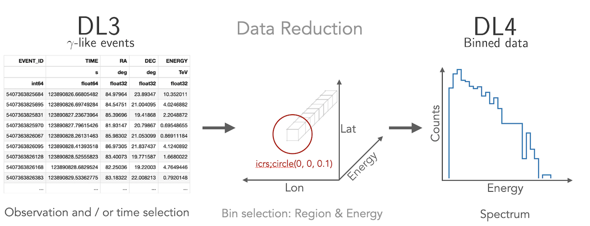
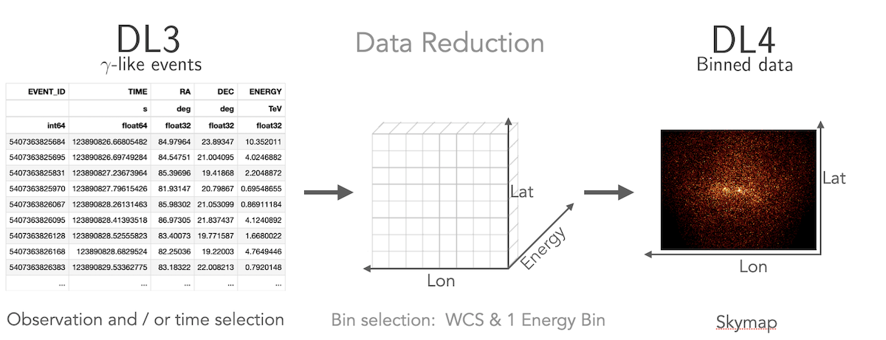
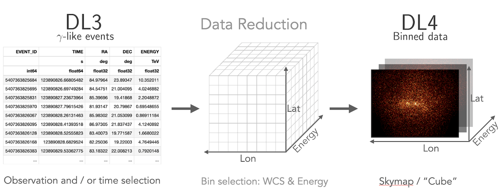

.. include:: ../references.txt

.. _getting-started:

===============
Getting started
===============

.. toctree::
    :hidden:

    install
    environments
    usage
    troubleshooting

Installation
------------

There are various ways for users to install Gammapy. **We recommend setting up a virtual
environment using either conda or mamba.** Here are two methods to quickly install Gammapy.

.. panels::
    :column: col-lg-6 col-md-6 col-sm-12 col-xs-12 p-3

    Working with conda?
    ^^^^^^^^^^^^^^^^^^^

    Gammapy can be installed with `Anaconda <https://docs.continuum.io/anaconda/>`__:

    .. code-block:: bash

        $ conda install -c conda-forge gammapy

    ---

    Prefer pip?
    ^^^^^^^^^^^

    Gammapy can be installed via pip from `PyPI <https://pypi.org/project/gammapy/>`__.

    .. code-block:: bash

        $ pip install gammapy

    ---
    :column: col-12 p-3

    In-depth instructions?
    ^^^^^^^^^^^^^^^^^^^^^^

    Update existing version? Working with virtual environments? Installing a specific version? Check the advanced
    installation page.

    .. link-button:: install
        :type: ref
        :text: Learn more
        :classes: btn-secondary stretched-link

.. include:: quickstart.rst

Tutorials Overview
------------------

.. accordion-header::
    :id: collapseOne
    :title: How to access gamma-ray data
    :link: ../tutorials/data/cta.html

Gammapy can read and access data from multiple gamma-ray instruments. Data from
Imaging Atmospheric Cherenkov Telescopes, such as `CTA`_, `H.E.S.S.`_, `MAGIC`_
and `VERITAS`_, is typically accessed from the **event list data level**, called "DL3".
This is most easily done using the `~gammapy.data.DataStore` class. In addition data
can also be accessed from the **level of binned events and pre-reduced instrument response functions**,
so called "DL4". This is typically the case for `Fermi-LAT`_ data or data from
Water Cherenkov Observatories. This data can be read directly using the
`~gammapy.maps.Map` and `~gammapy.irf.core.IRFMap` classes.

:link-badge:`../tutorials/data/cta.html,"CTA data tutorial",cls=badge-primary text-white`
:link-badge:`../tutorials/data/hess.html,"HESS data tutorial",cls=badge-primary text-white`
:link-badge:`../tutorials/data/fermi_lat.html,"Fermi-LAT data tutorial",cls=badge-primary text-white`

.. accordion-footer::

.. accordion-header::
    :id: collapseTwo
    :title: How to compute a 1D spectrum
    :link: ../tutorials/analysis-1d/spectral_analysis.html

Gammapy lets you create a 1D spectrum by defining an analysis region in
the sky and energy binning using  `~gammapy.maps.RegionGeom` object.
The **events and instrument response are binned** into `~gammapy.maps.RegionNDMap`
and `~gammapy.irf.IRFMap` objects. In addition you can choose to estimate
the background from data using e.g. a **reflected regions method**.
Flux points can be computed using the `~gammapy.estimators.FluxPointsEstimator`.

|

:link-badge:`../tutorials/analysis-1d/spectral_analysis.html,"1D analysis tutorial",cls=badge-primary text-white`
:link-badge:`../tutorials/analysis-1d/spectral_analysis_rad_max.html,"1D analysis tutorial with point-like IRFs",cls=badge-primary text-white`
:link-badge:`../tutorials/analysis-1d/extended_source_spectral_analysis.html,"1D analysis tutorial of extended sources",cls=badge-primary text-white`

.. accordion-footer::

.. accordion-header::
    :id: collapseThree
    :title: How to compute a 2D image
    :link: ../tutorials/index.html#d-image

Gammapy treats 2D maps as 3D cubes with one bin in energy. Computation
of 2D images can be done following a 3D analysis with one bin with a
fixed spectral index, or following the classical ring background estimation.

|

:link-badge:`../tutorials/analysis-2d/modeling_2D.html,"2D analysis tutorial",cls=badge-primary text-white`
:link-badge:`../tutorials/analysis-2d/ring_background.html,"2D analysis tutorial with ring background",cls=badge-primary text-white`

.. accordion-footer::

.. accordion-header::
    :id: collapseFour
    :title: How to compute a 3D cube
    :link: ../tutorials/analysis-3d/analysis_3d.html

Gammapy lets you perform a combined spectral and spatial analysis as well.
This is sometimes called in jargon a "cube analysis". Based on the 3D data reduction
Gammapy can also simulate events. Flux points can be computed using the
`~gammapy.estimators.FluxPointsEstimator`.

|

:link-badge:`../tutorials/analysis-3d/analysis_3d.html,"3D analysis tutorial",cls=badge-primary text-white`
:link-badge:`../tutorials/analysis-3d/event_sampling.html,"3D analysis tutorial with event sampling",cls=badge-primary text-white`

.. accordion-footer::

.. accordion-header::
    :id: collapseFive
    :title: How to compute a lightcurve
    :link: ../tutorials/analysis-time/light_curve.html

Gammapy allows you to compute light curves in various ways. Light curves
can be computed for a **1D or 3D analysis scenario** (see above) by either
grouping or splitting the DL3 data into multiple time intervals. Grouping
mutiple observations allows for computing e.g. a **monthly or nightly light curves**,
while splitting of a single observation allows to compute **light curves for flares**.
You can also compute light curves in multiple energy bands. In all cases the light
curve is computed using the `~gammapy.estimators.LightCurveEstimator`.

:link-badge:`../tutorials/analysis-time/light_curve.html,"Light curve tutorial",cls=badge-primary text-white`
:link-badge:`../tutorials/analysis-time/light_curve_flare.html,"Light curve tutorial for flares",cls=badge-primary text-white`

.. accordion-footer::

.. accordion-header::
    :id: collapseSix
    :title: How to combine data from multiple instruments
    :link: ../tutorials/analysis-3d/analysis_mwl.html

Gammapy offers the possibility to **combine data from multiple instruments**
in a "joint-likelihood" fit. This can be done at **multiple data levels** and
independent dimensionality of the data. Gammapy can handle 1D and 3D datasets
at the same time and can also include e.g. flux points in a combined likelihood fit.

:link-badge:`../tutorials/analysis-3d/analysis_mwl.html,"Combined 1D / 3D analysis tutorial",cls=badge-primary text-white`
:link-badge:`../tutorials/analysis-1d/sed_fitting.html,"SED fitting tutorial",cls=badge-primary text-white`

.. accordion-footer::

