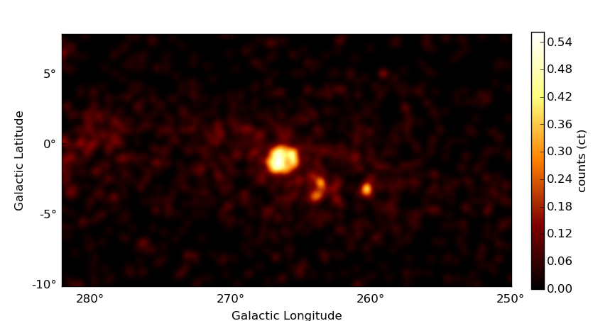

.. include:: ../references.txt

.. _image:

*****************************************************
Image processing and analysis tools (`gammapy.image`)
*****************************************************

.. currentmodule:: gammapy.image

Introduction
============

`gammapy.image` contains data classes and methods for image based analysis
of gamma-ray data.

Getting Started
===============

The central data structure in `gammapy.image` is the `gammapy.image.SkyImage`
class, which combines the raw data with WCS information, FITS I/O functionality
and many other methods, that allow easy handling, processing and plotting of
image based data. Here is a first example:

.. code-block:: python

   >>> from gammapy.datasets import gammapy_extra
   >>> from gammapy.image import SkyImage
   >>> filename = gammapy_extra.filename('datasets/fermi_2fhl/fermi_2fhl_vela.fits.gz')
   >>> skyimage = SkyImage.read(filename, ext=2)
   >>> skyimage.show()

This loads a prepared Fermi 2FHL FITS image of the Vela region, creates a
`gammapy.image.SkyImage` and shows it on the the screen by calling `gammapy.image.SkyImage.show()`.
The image looks as following:

   Smoothed counts map of the Vela region computed with gammapy (see `script
   in gammapy-extra <https://github.com/gammapy/gammapy-extra/blob/master/datasets/fermi_2fhl/fermi_skyimages.py>`_)

To explore further the SkyImage class try tab completion on the ``skyimage`` object
in an interactive python environment or see the _`skymaps` page.

Using `gammapy.image`
=====================

If you'd like to learn more about using `gammapy.image`, read the following sub-pages:

.. toctree::
   :maxdepth: 1

   skymaps
   plotting

Reference/API
=============

.. automodapi:: gammapy.image
    :no-inheritance-diagram:
