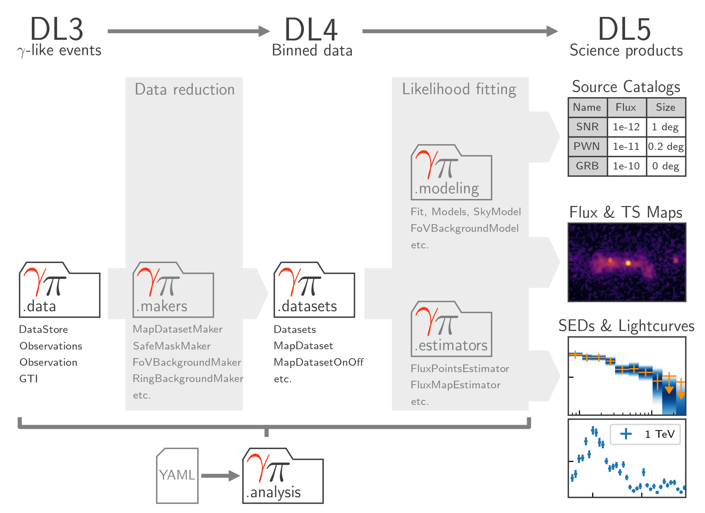

.. include:: references.txt

.. _overview:

Overview
========

This page gives an overview of the main concepts in Gammapy. It is a theoretical
introduction to Gammapy, explaining which data, sub-packages, classes and methods
are involved in a data analysis with Gammapy.

.. _data_flow:

    Data flow and sub-package structure of Gammapy. The folder icons
    represent the corresponding sub-packages. The direction of the
    the data flow is illustrated with shaded arrows. The top section
    shows the data levels as defined by `CTA`_.

Gammapy is organised in sub-packages. Figure :numref:`data_flow` illustrates
the data flow and sub-package structure of Gammapy.

Data access (DL3)
-----------------

The data analysis starts with :ref:`data level 3 <overview_DL3>`
(DL3) FITS files consisting of event lists, instrument response information
(effective area, point spread function, energy dispersion, background) and
extra information concerning the observation (pointing direction, time),
as well as two index tables that list the observations and declare which
response should be used with which event data.

For each observation, instrument response functions (namely effective area, point spread function, energy
dispersion, background) are distributed. Some details about the origin of these functions are given
in :ref:`irf-theory`. The functions are stored in the form of multidimensional tables giving the IRF
value as a function of position in the field-of-view and energy of the incident photon.

The formats used are discussed and described in `gadf`_. This format is still a prototype. In the coming
years CTA will develop and define it's release data format, and Gammapy  will adapt to that.

The main classes in Gammapy to access the DL3 data library are the
`~gammapy.data.DataStore` and `~gammapy.data.Observation`.
They are used to store and retrieve dynamically the datasets
relevant to any observation (event list in the form of an `~gammapy.data.EventList`,
IRFs see :ref:`irf` and other relevant informations).

Once some observation selection has been selected, the user can build a list of observations:
a `~gammapy.data.Observations` object, which will be used for the data reduction process.

See :ref:`gammapy.data <data>` and :ref:`gammapy.irf <irf>`

.. _overview_data:

Data reduction (DL3 -> DL4)
---------------------------

There are many data reduction options, but the main ones are whether to do a 3D
cube analysis or a 1D spectral analysis, and whether to keep individual
observations as separate datasets for a joint likelihood fit or whether to group
and stack them. Partly background modeling choices are also already made at this
data reduction stage. If you have a deep IACT observation, e.g. 100 observation
runs, the data reduction can take a while. So typically you write the output
datasets to file after data reduction, allowing you to read them back at any
time later for modeling and fitting.

:ref:`gammapy.makers <makers>`

.. _overview_datasets:

Datasets (DL4)
--------------

The `gammapy.datasets` sub-package contains classes to handle reduced
gamma-ray data for modeling and fitting.

The `Dataset` objects are the result of the data reduction step. They contain the various
products (`counts`, `exposure`, `energy dispersion` etc) with their geometries. They also
serve as the basis for modeling and fitting.

The `Dataset` class bundles reduced data, reduced IRFs and models.
Different sub-classes support different analysis methods and fit statistics
(e.g. Poisson statistics with known background or with OFF background measurements).

The `Datasets` are used to perform joint-likelihood fitting allowing to combine
different measurements, e.g. from different observations but also from different
instruments.

To learn more about datasets, see :ref:`gammapy.datasets <datasets>`.

Gammapy supports binned simulation, i.e. Poisson fluctuation of predicted
counts maps or spectra, as well as event sampling to simulate DL3 events data.

.. _overview_modeling:

Modeling and Fitting (DL4 -> DL5)
---------------------------------

Beyond `Dataset` objects, Gammapy provides numerous functionalities related
to data modeling and fitting, as well as data simulation.
This includes spectral, spatial and temporal model classes to describe the gamma-ray sky.
Gammapy also contains a complete API for model parameter handling and model fitting,
with a large choice of spatial, spectral and temporal models. You may check out the whole list
of built-in models in the :ref:`model-gallery`.

To learn more about modeling and fitting, see  :ref:`gammapy.modeling <modeling>`
and :ref:`gammapy.estimators <estimators`. To compute light curves, use the
`~gammapy.estimators.LightCurveEstimator`.

High Level Analysis Interface
-----------------------------
A convenient way to do this is to use the high level interface,
see :ref:`gammapy.analysis <analysis>`.

.. _overview_other:

Other topics
------------

this overview we only mentioned the most important concepts and parts to get
started. To learn more, see the following sub packages and documentation pages:
:ref:`gammapy.data <data>`, :ref:`gammapy.irf <irf>`, :ref:`gammapy.maps
<maps>`, :ref:`gammapy.catalog <catalog>`, :ref:`gammapy.astro <astro>`,
:ref:`gammapy.stats <stats>`,
:ref:`gammapy.scripts <CLI>` (``gammapy`` command line tool).

Note that in Gammapy, 2D image analyses are partly done with actual 2D images
that don't have an energy axis, and partly with 3D cubes with a single energy bin,
e.g. for modeling and fitting,
see the `2D map analysis tutorial <./tutorials/image_analysis.html>`__.

For 1D spectral modeling and fitting, `~gammapy.modeling.models.Models` are
used, to provide uniformity within Gammapy, and to allow in future versions of
Gammapy for advanced use cases where a sky region based analysis is used
resulting in 1D counts spetra, but the modeling is done with a spatial model
assumption, allowing for treatment of overlapping emission components, such as
e.g. a gamma-ray binary with underlying emission from a pulsar wind nebula, to
apply proper treatment of containment and contamination corrections. Note that
the spatial model on a `~gammapy.modeling.models.SkyModel` is optional, you can
only pass a `~gammapy.modeling.models.SpectralModel`, as shown in the `First
analysis tutorial notebook <./tutorials/analysis_1.html>`__ and other tutorials.

.. _overview_next:

What next?
----------

You now have an overview of Gammapy. We suggest you continue by tring it out,
following the instructions in :ref:`install`, :ref:`getting-started` and then
the first and second analysis tutorials at :ref:`tutorials`.

.. toctree::
    :caption: Overview Subsections
    :maxdepth: 1

    overview/DL3
