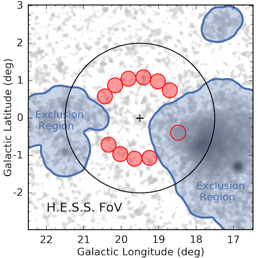

.. include:: ../../references.txt

.. _reflected_background:

****************************
Reflected regions background
****************************

.. currentmodule:: gammapy.makers

Overview
--------

This method is used in classical Cherenkov astronomy to estimate background
for spectral analysis. As illustrated in Fig. 1,
a region on the sky, the ON region, is chosen to select events
around the studied source position. In the absence of a solid template of the
residual hadronic background, a classical method to estimate it is the so-called
Reflected Region Background. The underlying assumption is that the background is
approximately purely radial in the field-of-view. A set of OFF counts is found
in the observation, by rotating the ON region selected around the pointing
position. To avoid that the reflected regions contain actual gamma-ray signal
from other objects, one has to remove the gamma-ray bright parts of the
field-of-view with a exclusion mask. More details on the reflected regions method can
be found in [Berge2007]_.

.. _figure_reflected_background:

    Fig.1, Illustration of the reflected regions background estimation method, taken from [Abdalla2018]_.

The extraction of the OFF events from the `~gammapy.data.EventList` of a
set of observations is performed by the `~gammapy.makers.ReflectedRegionsBackgroundMaker`.
The latter uses the `~gammapy.makers.ReflectedRegionsFinder` to create reflected
regions for a given circular on region and exclusion mask.

.. code-block:: python

    from gammapy.makers import SpectrumDatasetMaker, ReflectedRegionsBackgroundMaker, SafeMaskMaker
    from gammapy.datasets import SpectrumDataset, Datasets
    from gammapy.data import DataStore
    from gammapy.maps import MapAxis, Map, WcsGeom, RegionGeom

    data_store = DataStore.from_dir("$GAMMAPY_DATA/hess-dl3-dr1")
    observations = data_store.get_observations([23592, 23559])

    energy_axis = MapAxis.from_energy_bounds("0.5 TeV", "10 TeV", nbin=15)
    energy_axis_true = MapAxis.from_energy_bounds("0.3 TeV", "20 TeV", nbin=40, name="energy_true")

    geom = RegionGeom.create(region="icrs;circle(83.63,22.01,0.11)", axes=[energy_axis])
    dataset_empty = SpectrumDataset.create(geom=geom, energy_axis_true=energy_axis_true)

    wcsgeom = WcsGeom.create(skydir=geom.center_skydir, width=5, binsz=0.02)
    exclusion_mask = wcsgeom.region_mask(geom.region, inside=False)

    maker = SpectrumDatasetMaker()
    safe_mask_maker = SafeMaskMaker(methods=["aeff-max"], aeff_percent=10)

    bkg_maker = ReflectedRegionsBackgroundMaker(exclusion_mask=exclusion_mask)

    datasets = Datasets()
    for obs in observations:
        dataset = maker.run(dataset_empty.copy(), obs)
        dataset = safe_mask_maker.run(dataset, obs)
        dataset_on_off = bkg_maker.run(dataset, obs)
        datasets.append(dataset)

Using regions
-------------

The on region is a `~regions.SkyRegion`. It is typically a circle
(`~regions.CircleSkyRegion`) for point-like source analysis, but it can also be a more
complex region such as a `~regions.CircleAnnulusSkyRegion`,
`~regions.EllipseSkyRegion`, `~regions.RectangleSkyRegion` etc.

The following example shows how to create such regions:

.. plot:: user-guide/makers/create_region.py
    :include-source:

The reflected region finder
---------------------------

The following example illustrates how to create reflected regions for a given
circular on region and exclusion mask using the
`~gammapy.makers.ReflectedRegionsFinder`. In particular, it shows how to
change the minimal distance between the ON region and the reflected regions.
This is useful to limit contamination by events leaking out the ON region. It
also shows how to change the minimum distance between adjacent regions as well
as the maximum number of reflected regions.

.. plot:: user-guide/makers/make_reflected_regions.py
    :include-source:

Using the reflected background estimator
----------------------------------------

In practice, the user does not usually need to directly interact with the
`~gammapy.makers.ReflectedRegionsFinder`. This actually is done via the
`~gammapy.makers.ReflectedRegionsBackgroundMaker`, which extracts the ON
and OFF events for an `~gammapy.data.Observations` object. The last example
shows how to run it on a few observations with a rectangular region.

.. plot:: user-guide/makers/make_rectangular_reflected_background.py
    :include-source:

.. minigallery::
    :add-heading: Examples using `~gammapy.makers.ReflectedRegionsBackgroundMaker`

    ../examples/tutorials/analysis-1d/spectral_analysis.py
    ../examples/tutorials/analysis-1d/extended_source_spectral_analysis.py
    ../examples/tutorials/analysis-1d/spectral_analysis_rad_max.py
