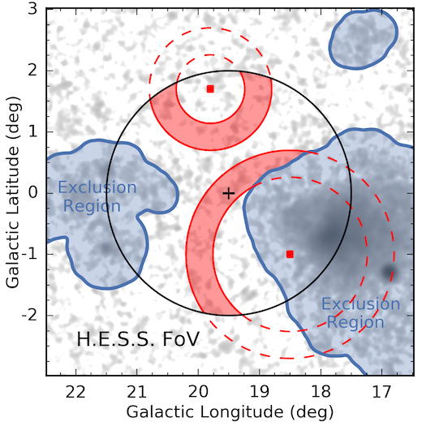

.. include:: ../../references.txt

.. _ring_background:

***************
Ring background
***************

Overview
--------
This background estimation technique is used in classical Cherenkov astronomy
for 2D image analysis. The working principle is illustrated in Fig. 1.
For any given pixel in a counts map the off counts are estimate from a ring
centered on the test position with a given fixed radius and width. To improve
the estimate, regions with known gamma-ray emission are excluded from measuring
the off events. A variation of this methods is given by the "adaptive" ring.
In some regions (e.g. in the Galactic plane) a lot of gamma-ray emission
has to be excluded and there are not many regions left to estimate the background
from. To improve the off statistics in this case, the ring is adaptively
enlarged to achieve a defined minimal background efficiency ratio (see :ref:`stats_notation`).
More details on the ring background method can be found in [Berge2007]_.

.. _figure_ring_background:

    Fig.1, Illustration of the ring background estimation method, taken from [Abdalla2018]_.

To include the classical ring background estimation into a data reduction
chain, Gammapy provides the `~gammapy.makers.RingBackgroundMaker` and `~gammapy.makers.AdaptiveRingBackgroundMaker`
classed. These classes can only be used for image based data.
A given `~gammapy.datasets.MapDataset` has to be reduced to a single image by calling
`gammapy.datasets.MapDataset.to_image()`

.. testcode::

	from gammapy.makers import MapDatasetMaker, RingBackgroundMaker, SafeMaskMaker
	from gammapy.datasets import MapDataset, MapDatasetOnOff
	from gammapy.data import DataStore
	from gammapy.maps import MapAxis, WcsGeom, Map
	from regions import CircleSkyRegion
	from astropy import units as u

	data_store = DataStore.from_dir("$GAMMAPY_DATA/hess-dl3-dr1")
	observations = data_store.get_observations([23592, 23559])

	energy_axis = MapAxis.from_energy_bounds("1 TeV", "10 TeV", nbin=1)
	energy_axis_true = MapAxis.from_energy_bounds("0.3 TeV", "30 TeV", nbin=20, per_decade=True, name="energy_true")

	geom = WcsGeom.create(skydir=(83.63, 22.01), axes=[energy_axis], width=5, binsz=0.02)

	empty = MapDataset.create(geom, energy_axis_true=energy_axis_true)
	stacked = MapDatasetOnOff.create(geom, energy_axis_true=energy_axis_true)

	maker = MapDatasetMaker()
	safe_mask_maker = SafeMaskMaker(
		methods=["aeff-default", "offset-max"], offset_max="2.5 deg"
	)

	circle = CircleSkyRegion(center=geom.center_skydir, radius=0.2 * u.deg)
	exclusion_mask = geom.region_mask([circle], inside=False)

	ring_bkg_maker = RingBackgroundMaker(r_in="0.3 deg", width="0.3 deg", exclusion_mask=exclusion_mask)

	for obs in observations:
		dataset = maker.run(empty, obs)
		dataset = safe_mask_maker.run(dataset, obs)
		dataset_on_off = ring_bkg_maker.run(dataset)
		stacked.stack(dataset_on_off)

.. minigallery::
    :add-heading: Examples using `~gammapy.makers.RingBackgroundMaker`

    ../examples/tutorials/analysis-2d/ring_background.py
