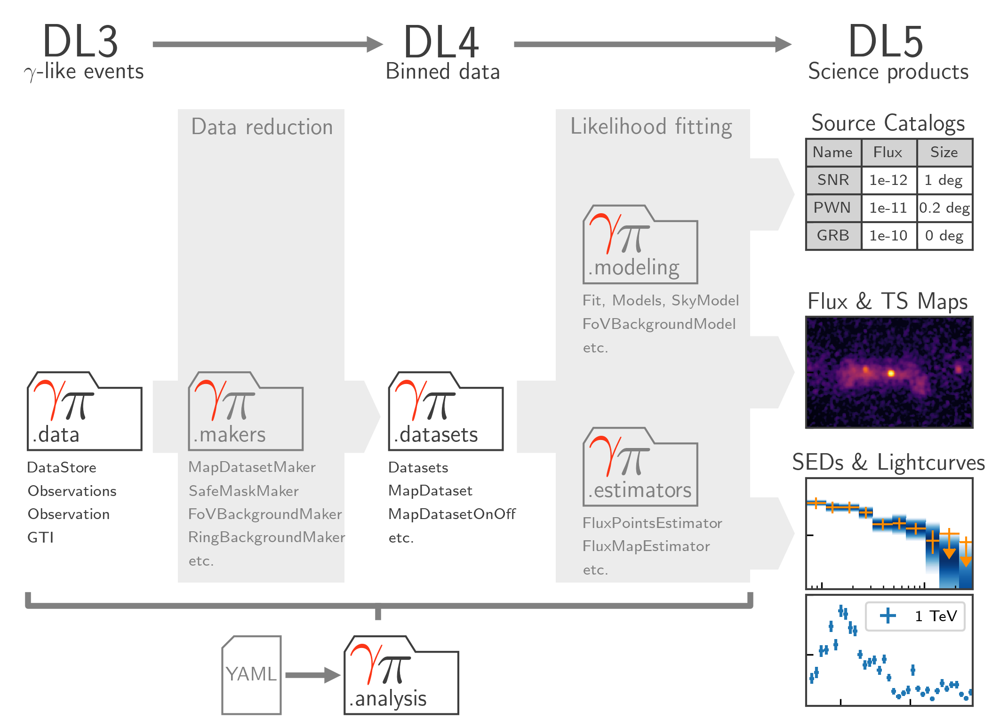

.. include:: ../references.txt

.. _package_structure:

Gammapy analysis workflow and package structure
===============================================

.. toctree::
    :hidden:
    :includehidden:

    dl3
    irf/index
    makers/index
    maps/index
    datasets/index
    modeling
    estimators
    hli
    scripts/index
    catalog
    astro/index
    stats/index
    visualization/index
    utils

Analysis workflow
-----------------

:ref:`Fig. 1 <data_flow>` illustrates the standard analysis flow and the corresponding
sub-package structure of Gammapy. Gammapy can be typically used with the configuration
based high level analysis API or as a standard Python library by importing the functionality
from sub-packages. The different data levels and data reduction steps and how they map to
the Gammapy API are explained in more detail in the following.

.. _data_flow:

    Fig. 1 Data flow and sub-package structure of Gammapy. The folder icons
    represent the corresponding sub-packages. The direction of the
    the data flow is illustrated with shaded arrows. The top section
    shows the data levels as defined by `CTAO`_.

Analysis steps
--------------

:ref:`data`
    The analysis of gamma-ray data with Gammapy starts at the "data level 3".
    At this level the data is stored as lists of gamma-like events and the corresponding
    instrument response functions (IRFs).

:ref:`irf`
    Gammapy supports various forms of instrument response functions (IRFs), which are represented
    as multidimensional data classes.

:ref:`makers`
    The events and instrument response are projected and binned onto the selected geometry.
    To limit uncertainties, additional background estimation methods are applied
    and "safe" data analysis range is determined.

:ref:`maps`
    Gammapy represents data on multi-dimensional maps which are defined with a geometry
    representing spatial and spectral coordinates. The former can be a spherical map
    projection system or a simple sky region.

:ref:`datasets`
    The datasets classes bundle reduced data in form of maps, reduced IRFs, models and
    fit statistics and allow to perform likelihood fitting. Different classes support different
    analysis methods and fit statistics. The datasets are used to perform joint-likelihood
    fitting allowing to combine different measurement.

:ref:`modeling`
    Gammapy provides a uniform interface to multiple fitting backends to fit the datasets
    model parameters on the reduced data with maximum likelihood techniques.

:ref:`estimators`
    In addition to the global modelling and fitting, Gammapy provides utility classes to
    compute and store flux points, light curves and flux as well as significance maps in energy bands.

Configurable analysis
---------------------

:ref:`analysis`
    To define and execute a full data analysis process from a YAML configuration file,
    Gammapy implements a high level analysis interface. It exposes a subset of
    the functionality that is available in the sub-packages to support
    standard analysis use case in a convenient way.

:ref:`CLI`
    A minimal command line interface (CLI) is provided for commonly used and easy
    to configure analysis tasks.

Additional utilities
--------------------

:ref:`catalog`
    Access to a variety of GeV-TeV gamma-ray catalogs.

:ref:`stats`
    Statistical estimators, fit statistics and algorithms commonly used in gamma-ray astronomy.

:ref:`astro`
    Support for simulation of TeV source populations and dark matter models.

:ref:`visualization`
    Helper functions and classes to create publication-quality images.

:ref:`utils`
    Utility functions that are used in many places or don’t fit in one of the other packages.
